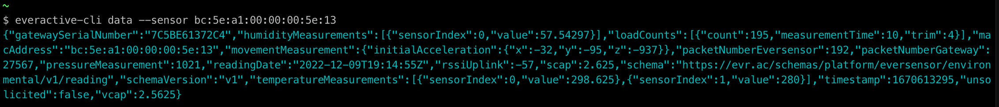

# Everactive Edge Platform CLI

The `everactive-cli` is a tool to interact with the Everactive APIs from your terminal.
It features commands to list Eversensors and to retrieve data on demand and in streaming mode.


The tool is compatible with Windows, macOS, and Linux.

# Installation

Download the binary for your platform.

> TODO: brew, scoop, snap, etc?

# Usage

The tool provides different commands. Type `everactive-cli` to get a list of options and information.

```
$ everactive-cli
Set up your API credentials via the "credentials" command or as environment variables.
After that, you can list sensors, get readings, or stream data from the API.

Usage:
  everactive-cli [command]

Available Commands:
  completion   Generate the autocompletion script for the specified shell
  credentials  Credentials configuration
  data         Retrieve readings data from a sensor and a given time range.
  heartbeat    Check the connection to the Everactive API
  help         Help about any command
  list-sensors Get a list of the Eversensors in your account
  stream       Retrieve the eversensor readings in streaming mode, starting now and polling for new data every 5 seconds
  version      Print the version of the application

Flags:
  -d, --debug   enable debug mode
  -h, --help    help for everactive-cli

Use "everactive-cli [command] --help" for more information about a command.
```

## Credentials Configuration

The first thing you should do is configure the credentials for the Everactive API.
You can do this in two ways:

### 1. Configuration file

The command `everactive-cli credentials init` helps you create a configuration file in your home folder to save the credentials.

```
$ everactive-cli credentials init
Please enter the Client ID: your_api_key
Please enter the Client Secret: ****************************************************************
saved configuration in /Users/ford.prefect/.everactive/config.yaml
```

### 2. Environment variables

Set the following environment variables:
```
EVERACTIVE_CLIENT_ID=your_api_key
EVERACTIVE_CLIENT_SECRET=your_api_secret
```


# Eversensors

To get a list of eversensors use the command: `everactive-cli list-sensors`. The commands lists every sensor that is currently available to the account along with its type, firmware version, and the last association with the gateway (sundance or apex).

```
$ everactive-cli list-sensors
Total count: 2
Mac: bc:5e:a1:00:00:00:5e:13 - Type: Environmental - FW: tinytiger-f0/v0.5.7-r2700fc09 - Association: 7C5BE61372C4 2022-11-13 08:47:27 +0000 UTC
Mac: bc:5e:a1:00:00:00:5e:19 - Type: Environmental - FW: tinytiger-f0/v0.5.7-r2700fc09 - Association: 7C5BE61372C4 2022-11-15 15:40:37 +0000 UTC

```

## Sensor Data

Retrieve the data from a sensor for a specific time range. The data is return in Json format.

By default the command retrieves the last reading from the given Eversensor:

```
$ everactive-cli data --sensor bc:5e:a1:00:00:00:5e:13
```




You can also get readings from a duration in Hours, Minutes, or seconds. The max period is 24hrs.

```
$ everactive-cli data --sensor bc:5e:a1:00:00:00:5e:13 --range 1h
```

To get data from a specific time range, use UNIX timestamps:

```
$ everactive-cli data --sensor bc:5e:a1:00:00:00:5e:13 --range 1670507054-1670533006
```

## Streaming Data

The streaming mode polls the Everactive API every few seconds to get the latest set of readings. The data is received as soon as it becomes available in our cloud service.

```
$ everactive-cli stream --sensor bc:5e:a1:00:00:00:5e:13
```
