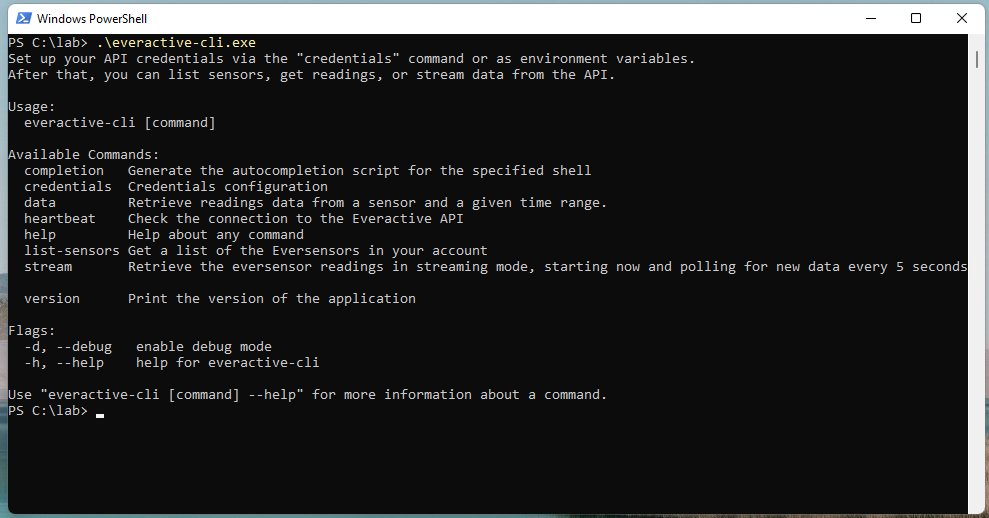

# Everactive Edge Platform CLI

The `everactive-cli` is a tool to interact with the Everactive APIs from your terminal.

It features:
 * list sensors
 * get data in streaming mode (polling, really)
 * get data for a time range
 * clean json output to redirect to a file


The tool is compatible with Windows, macOS, and Linux.

# Installation

Download the binary for your platform from the Package Registry: https://gitlab.com/everactive/everactive-cli/-/packages/


> TODO: brew, scoop, snap, etc?

# Build

Install golang V1.19+ and run the `build.sh` script.

# Usage

The tool provides different commands. Type `everactive-cli` to get a list of options and information.



## Credentials Configuration

The first thing you should do is configure the credentials for the Everactive API.
You can do this in two ways:

### 1. Configuration file

The command `everactive-cli credentials init` helps you create a configuration file in your home folder to save the credentials.

```
$ everactive-cli credentials init
Please enter the Client ID: your_api_key
Please enter the Client Secret: ****************************************************************
saved configuration in /Users/ford.prefect/.everactive/config.yaml
```

> On Windows the configuration file would save at C:\Users\ford.prefect/.everactive/config.yaml

### 2. Environment variables

Set the following environment variables:
```
EVERACTIVE_CLIENT_ID=your_api_key
EVERACTIVE_CLIENT_SECRET=your_api_secret
```


# Eversensors

To get a list of eversensors use the command: `everactive-cli list-sensors`. The commands lists every sensor that is currently available to the account along with its type, firmware version, and the last association with the gateway (sundance or apex).

```
$ everactive-cli list-sensors
Total count: 2
Mac: bc:5e:a1:00:00:00:5e:13 - Type: Environmental - FW: tinytiger-f0/v0.5.7-r2700fc09 - Association: 7C5BE61372C4 2022-11-13 08:47:27 +0000 UTC
Mac: bc:5e:a1:00:00:00:5e:19 - Type: Environmental - FW: tinytiger-f0/v0.5.7-r2700fc09 - Association: 7C5BE61372C4 2022-11-15 15:40:37 +0000 UTC

```

## Streaming Data

The streaming mode polls the Everactive API every few seconds to get the latest set of readings. The data is received as soon as it becomes available in our cloud service.

```
$ everactive-cli stream --sensor bc:5e:a1:00:00:00:5e:13
```

## Sensor Data

Retrieve the data from a sensor for a specific time range. The data is return in Json format.

By default the command retrieves the last reading from the given Eversensor:

```
$ everactive-cli data --sensor bc:5e:a1:00:00:00:5e:13
```


You can also get readings from a duration in Hours, Minutes, or seconds. The max period is 24hrs.

```
$ everactive-cli data --sensor bc:5e:a1:00:00:00:5e:13 --range 1h
```

To get data from a specific time range, use UNIX timestamps:

```
$ everactive-cli data --sensor bc:5e:a1:00:00:00:5e:13 --range 1670507054-1670533006
```


